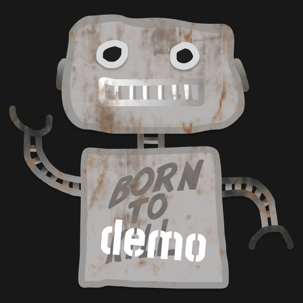

<h1> Schematic Slack Bot Demo</h1>

This is a demo Slack bot that integrates with the [Schematic API](https://schematichq.com) to show notifications in Slack.

> [!NOTE]
> This demo was created from the [Bolt for JavaScript (TypeScript) Template App](https://github.com/slack-samples/bolt-ts-starter-template) and uses the [Bolt for JavaScript](https://slack.dev/bolt-js) framework to create a Slack app.

> [!CAUTION]
> This is a demo application and should not be used in production. It is intended to show how to integrate the Schematic API with Slack.

## Installation

### Create a new Slack app

1. Open [https://api.slack.com/apps/new](https://api.slack.com/apps/new) and choose "From an app manifest"
2. Choose the workspace you want to install the application to
3. Copy the contents of [manifest.json](./manifest.json) into the text box that says `*Paste your manifest code here*` (within the JSON tab) and click _Next_
4. Review the configuration and click _Create_
5. Click _Install to Workspace_ and _Allow_ on the screen that follows. You'll then be redirected to the App Configuration dashboard.

### Environment variables

Before you can run the app, you'll need to store some environment variables.

1. Copy `env.sample` to `.env`
2. Open your apps configuration page from [this list](https://api.slack.com/apps), click _OAuth & Permissions_ in the left hand menu, then copy the _Bot User OAuth Token_ into your `.env` file under `SLACK_BOT_TOKEN`
3. Click _Basic Information_ from the left hand menu and follow the steps in the _App-Level Tokens_ section to create an app-level token with the `connections:write` scope. Copy that token into your `.env` as `SLACK_APP_TOKEN`.

### Install dependencies

`npm install`

### Run the app

`npm start`

## Setting Up the Schematic API Webhook

### Temporarily expose your local server

To receive webhooks from the Schematic API, you'll need to expose your local server to the internet, for example, using [`ngrok`](https://ngrok.com/):

```
ngrok http 3000
```

### Create a new webhook

1. Open the [Schematic dashboard](https://app.schematichq.com/)
1. Navigate to _More_ > _Integrations_ > _Webhooks_
1. Click _Create Webhook_
1. Enter a name for the webhook, e.g. "Slack Bot"
1. Enter the URL provided by `ngrok` in the _URL_ field:
   - `https://<your-ngrok-subdomain>.ngrok.io/schematic-webhook`
1. For the _Events_ field, select the following events:
   - `plan.entitlement.created`
   - `plan.entitlement.updated`
   - `plan.entitlement.deleted`
1. Click _Save_

### Invite the bot to a channel

1. Open the Slack app and navigate to the channel you want to add the bot to
1. Type `/` in the channel and select "Add apps to this channel"
1. Search for the app "Schematic Bot Demo" you created and click _Add_

## Test the bot

### Subscribe to an event

In the channel you added the bot to, type `/schematic subscribe <event>` where `<event>` is one of the following:

- `plan.entitlement.created`
- `plan.entitlement.updated`
- `plan.entitlement.deleted`

For example, type the following to subscribe to the `plan.entitlement.updated` event:

```
/schematic subscribe plan.entitlement.updated
```

You should see a message from the bot confirming the subscription.

### Make a change in Schematic

1. To to the Schematic Plans dashboard
2. Create, update, or delete a plan entitlement

### Check the Slack channel

You should see a message from the bot with details about the event that occurred.
